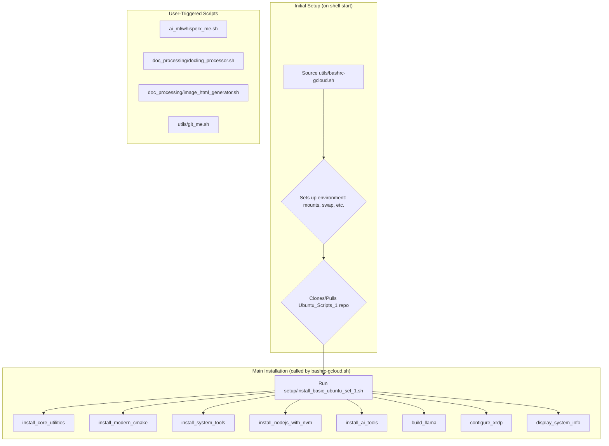

# Script Orchestration

This document outlines the high-level execution flow and relationships between key scripts in the `Ubuntu_Scripts_1` repository.

```mermaid
graph TD
    subgraph "Initial Setup (on shell start)"
        A[Source utils/bashrc-gcloud.sh] --> B{Sets up environment: mounts, swap, etc.};
        B --> C{Clones/Pulls Ubuntu_Scripts_1 repo};
    end

    subgraph "Main Installation (called by bashrc-gcloud.sh)"
        D[Run setup/install_basic_ubuntu_set_1.sh] --> E[install_core_utilities];
        D --> F[install_modern_cmake];
        D --> G[install_system_tools];
        D --> H[install_nodejs_with_nvm];
        D --> I[install_ai_tools];
        D --> J[build_llama];
        D --> K[configure_xrdp];
        D --> L[display_system_info];
    end

    subgraph "User-Triggered Scripts"
        M[ai_ml/whisperx_me.sh]
        N[doc_processing/docling_processor.sh]
        O[doc_processing/image_html_generator.sh]
        P[utils/git_me.sh]
    end

    C --> D;
```